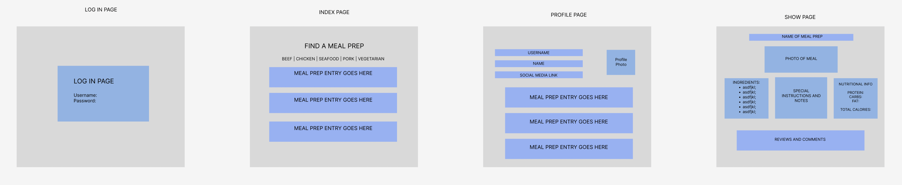

# Meal Prep App

    Project Description:
This is an application that will allow users to log in and post their favorite meal preps. The recipes will have instructions and a list of ingredients to prepare the meals.

    Technologies Used:
JavaScript, CSS (Bootstrap), EJS, MongoDB Atlas / Mongoose, Postman, Multer, OAuth

    User Stories:
As a user, I want to be able to create my own profile.
As a user, I want to be able to upload my meal prep recipes.
As a user, I want to be able to add images to the recipes I upload.
As a user, I want to be able to find recipes based on the type of protein.
As a user, I want to be able to use an API to fetch nutritional data (Edamam) or input those values myself.
As a user, I want to be able to add notes to the recipes (to clarify ingredients and special instructions for cooking.)

    Screenshots:

    MVP:
Users can post recipes to the page. 
Users can create a profile
Display recipes on the page for user.
Include a README file that illustrates the technologies used, the approach, and unsolved problems
Use EJS to render profile pages and index pages for recipes.

	Stretch Goals:
Use Third Party API to load in premade recipes for users that are looking for more.
Add profiles pages where people can see what meals they have posted.
Allow users to comment and rate other recipes.
Images should be deleted when the meal prep is deleted
Users should be able to edit their names
Users should be able to edit their meal pictures
User should be able to sign in through log in page.

    Major Hurdles:

Wireframe:

